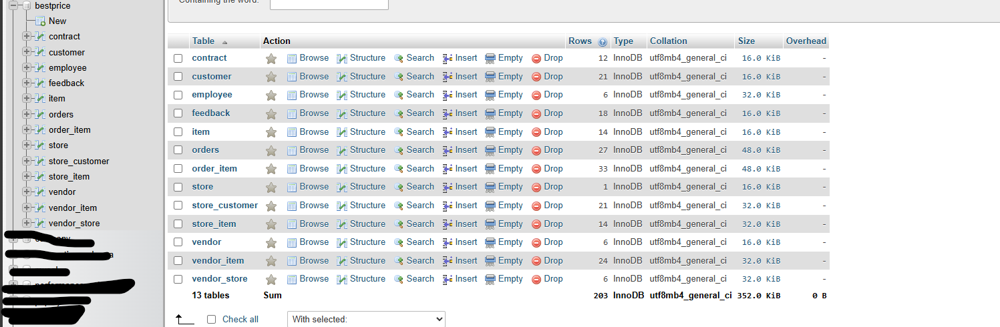
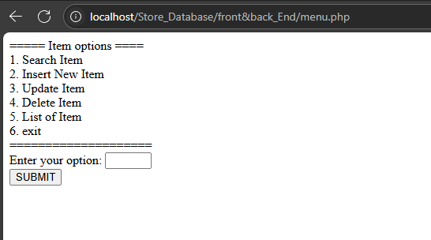
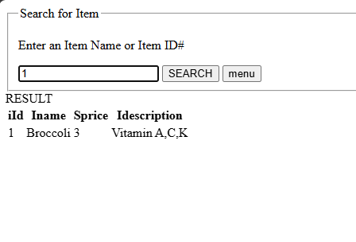

# Store\_Database Web Application

A simple inventory management system that demonstrates using MySQL with a PHP/HTML frontend on an XAMPP server. Import and manage data extracted from `.xlsx` files directly in your browser.

---

## 🚀 Features

* **Data Management**: Store and query items in a MySQL database.
* **Frontend**: Responsive HTML interface for easy navigation.
* **Backend**: PHP scripts handle form submissions, database CRUD operations, and business logic.
* **Import from Excel**: Convert `.xlsx` data into SQL records (via PHP).
* **List Items**: View the current inventory and all changes in real-time (Menu option 5).

---

## 📥 Prerequisites

1. **Download & Install XAMPP**
   Get XAMPP v3.3.0 (or later) from [https://www.apachefriends.org/index.html](https://www.apachefriends.org/index.html)
   Follow the installation steps for your OS (Windows, macOS, or Linux).

2. **Enable Services**

   * Open the **XAMPP Control Panel**.
   * Click **Start** next to **Apache**.
   * Click **Start** next to **MySQL**.

3. **Database Setup (Requires you to know how to add Data set into MySQL)**

   1. Open **phpMyAdmin** ([http://localhost/phpmyadmin](http://localhost/phpmyadmin)).
   2. Create a new database named `bestprice`.
   3. Import the provided `DDL.sql` to create the `ITEM` table.
   4. (OPTIONAL)In the `ITEM` table, set the `iId` column as **INT, PRIMARY KEY, AUTO\_INCREMENT**.
      (This just make searching new item easier when using ID)

**Final set up should look like**  


---

## 🛠️ Configuration

1. \*\*Project Folder
   Place the `front&back_End` directory under `xampp/htdocs/`.

   ````text
   xampp/
   └── htdocs/
       └── front&back_End/
           ├── dataset/           # Contains CSV data files (e.g., ITEM.csv, etc.) Place the dataset here!
           ├── menu.php
           ├── add_item.php
           ├── list_items.php
           ├── update_item.php
           └── store_schema.sql
   ````

## 🚀 Running the Application

1. **Start XAMPP Services**

   ```bash
   # From XAMPP Control Panel
   Start Apache
   Start MySQL
   ```
2. **Open in Browser**
   Navigate to:

   ```url
   http://localhost/front&back_End/menu.php
   ```
3. **Menu Options**

   1. **Add Item** – Insert a new product (name, quantity, price).

      * The `iId` field auto-increments; no need to specify it.
   2. **Update Item** – Modify existing records by `iId`.
   3. **Delete Item** – Remove a record by `iId`.
   4. **List Items** – View all current items and recent changes.




---

## ℹ️ Notes & Tips

* **AUTO\_INCREMENT**: Ensure `iId` is set to AUTO\_INCREMENT in MySQL to avoid manual key management.
* **Excel Import**: The import script expects a header row matching the `ITEM` columns (excluding `iId`).
* **Error Handling**: Basic validation is in place; refresh the page if invalid data is submitted.

---

## Summary
* The Best Store project is more focus on the MySQL(Backend) rather then the PHP and HTML or Front end aspect.
The Best Store project centers on MySQL, showcasing in depth expertise in both the theory and practice of relational databases. Key highlights include:

- **Relational Algebra & Querying**  
  Uses core operators (selection, projection, join, union, difference) translated into SQL with `WHERE`, `JOIN`, `GROUP BY` and `HAVING` for precise data retrieval.

- **Schema Design & Normalization**  
  Defines entities (e.g. `ITEM`) and attributes, applies 1NF–3NF rules, and enforces data integrity with primary keys (`iId`) and foreign keys.

- **Indexing Structures & Physical Design**  
  Builds B‑tree/B+‑tree and hash indexes on key columns, plans tablespaces/datafiles, and optimizes page/extent layouts for minimal I/O.

- **CRUD & ACID Transactions**  
  Implements create, read, update, delete via PHP scripts, using explicit transactions to ensure atomicity, consistency, isolation, and durability.

- **Data Import & Bulk Operations**  
  Parses `.xlsx`/CSV files into batched `INSERT` statements, leverages bulk‑load optimizations and index‑disable/rebuild strategies for high‑volume imports.

  By applying these topic, and theory together, I have optimized the Best Store project in a more comprehensive product to simulate real world use.

